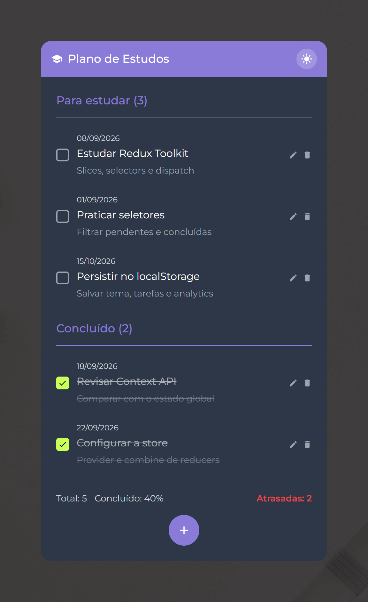

# Study Planner



A personalized study plan manager built with **React**, **Redux**, and the **Context API**.

**Live demo:** [https://danielgranato.github.io/study-planner-redux-context/](https://danielgranato.github.io/study-planner-redux-context/)

## 📖 About

Study Planner helps you organize and track your learning journey. It lets you visualize the total number of courses and tasks, monitor your completion progress, and manage tasks with optional notes — all updated in real time.

This project was built while following [Alura's course on state management with Redux and Context API](https://cursos.alura.com.br/course/react-gerenciando-estados-redux-context-api), and serves as a portfolio piece demonstrating global state management patterns in React.

## ✨ Features

- View the total number of courses and tasks
- Track the percentage of completed tasks
- Mark and unmark tasks as done
- Edit existing tasks
- Add optional descriptions/notes to tasks (e.g. "must be done with instructor Vinicios' course")
- Real-time updates as you interact with the app

## 🛠️ Tech Stack

- [React](https://react.dev/)
- [Redux](https://redux.js.org/) — global state management
- [Context API](https://react.dev/learn/passing-data-deeply-with-context) — local/shared state
- *(add your bundler here, e.g. Vite)*

## 🚀 Getting Started

### Prerequisites

- Node.js (version X or higher)
- npm or yarn

### Installation

```bash
# Clone the repository
git clone https://github.com/your-username/study-planner.git

# Navigate into the project folder
cd study-planner

# Install dependencies
npm install

# Start the development server
npm run dev
```

## 📁 Project Structure

```
study-planner/
├── src/
│   ├── components/
│   ├── pages/
│   ├── context/
│   ├── store/         # Redux store, slices/reducers
│   ├── hooks/
│   └── styles/
├── public/
└── README.md
```

*(adjust to match your actual folder structure)*

## 🎯 Learning Objectives

This project was built to practice:

- Managing global application state with Redux
- Sharing state across components with the Context API
- Building controlled forms and interactive task lists in React

## 📄 License

This project is open source and available under the [MIT License](LICENSE).
